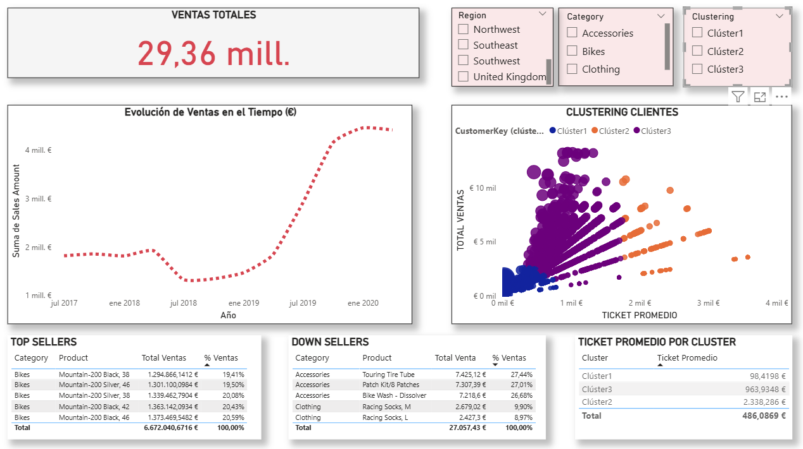

# BI-PROJECTS
# Análisis Comercial – Business Intelligence

## Descripción del proyecto 

La empresa objeto de análisis se dedica a la venta de bicicletas y accesorios, con operación comercial en los siguientes territorios: Estados Unidos, Canadá, Francia, Alemania, Australia e Inglaterra. 
Su modelo de negocio se basa en la comercialización de productos por categorías, atendiendo distintos tipos de clientes en múltiples regiones, lo que hace necesario un análisis estructurado del comportamiento de ventas para apoyar la toma de decisiones estratégicas. 

Este análisis busca transformar los datos comerciales en información accionable para apoyar la toma de decisiones estratégicas. 

 
## Objetivo del análisis 

Objetivo general 
Analizar el comportamiento de ventas de la empresa considerando categoría de producto, territorio y cliente, mediante el uso de herramientas de Business Intelligence. 

Objetivos específicos 
- Realizar una segmentación de clientes para identificar patrones de comportamiento similares. +
- Identificar el ticket promedio de compra a partir de los segmentos definidos. 
- Determinar productos top sellers y down sellers por territorio. 

 

## KPIs definidos 
Para el análisis se definieron los siguientes indicadores clave de desempeño (KPIs): 
- Total de ventas general 
- Total de ventas por categoría de producto 
- Total de ventas por región 
- Ticket promedio por segmento de cliente 

## Dashboard  

Dashboard desarrollado en Power BI. Visualización interactiva restringida por políticas institucionales. 

Dashboard desarrollado en Power BI, que permite el análisis interactivo del desempeño comercial: 

 
Capturas de interacción con los datos:  

 

## Insights clave  

A partir del análisis de la información, se identifica una disrupción en el comportamiento de las ventas a inicios del año 2019, seguida de un proceso de recuperación y estabilización a partir de enero de 2020, lo que sugiere un cambio relevante en la dinámica comercial de la empresa durante dicho período. 

El análisis del comportamiento de compra de los clientes permitió realizar una segmentación automática en tres grupos, diferenciados por su frecuencia de compra y nivel de gasto: 

- Cluster 1 – Clientes de bajo ticket: 
Corresponden a clientes con alta frecuencia de compra, concentrados en productos de bajo valor unitario, con un ticket promedio aproximado de 98 €. Este grupo aporta volumen de transacciones, aunque con menor impacto individual en ingresos, a los cuales se les podrían aplicar estrategias de cross-selling. 

- Cluster 2 – Clientes Premium: 
Se caracterizan por una frecuencia de compra moderada, pero orientada a productos de alto valor, con un ticket promedio cercano a 2.338 €. A pesar de realizar menos compras, este segmento representa un alto aporte al beneficio de la empresa. Dado su valor, se recomienda aplicar estrategias de fidelización que incluyan mayores beneficios e incluso atención personalizada. 

- Cluster 3 – Clientes Frecuentes: 
Presentan una frecuencia de compra sostenida y un ticket promedio medio, alrededor de 963 €, lo que los convierte en un segmento estable y relevante para el crecimiento continuo del negocio. Dada su frecuencia de compra, se podrían aplicar estrategias de cross-selling junto con estrategias de fidelización como brindar puntos por compras.  

De manera transversal a los tres segmentos, la categoría Bicicletas se posiciona como la de mayor desempeño comercial, concentrando los productos top sellers en todos los clusters analizados. 

En cuanto a los down sellers, se identifica la necesidad de evaluar su rentabilidad, con el fin de determinar si es conveniente diseñar estrategias comerciales específicas o reconsiderar su permanencia dentro del portafolio de productos. 

 
## Herramientas utilizadas 

Power BI y Power Query: modelado de datos, creación de medidas y visualización de información. 

 
## Resultados 

El dashboard desarrollado permite: 
- Monitorear el desempeño de las ventas totales, facilitando el análisis dinámico mediante filtros por región, categoría de producto y segmento de clientes (clusters). 
- Segmentar a los clientes a través de técnicas de clusterización, permitiendo analizar su comportamiento de compra en términos de frecuencia, valor total de compra y ticket promedio, y comprender el aporte de cada segmento al negocio. 
- Identificar los productos top sellers y down sellers, tanto a nivel general como de forma segmentada, aplicando filtros por región, categoría y cluster, lo que brinda una visión integral para la toma de decisiones comerciales. 

## Documentación completa
[Análisis Comercial BI (PDF)](Analisis_comercial.pdf)
 
